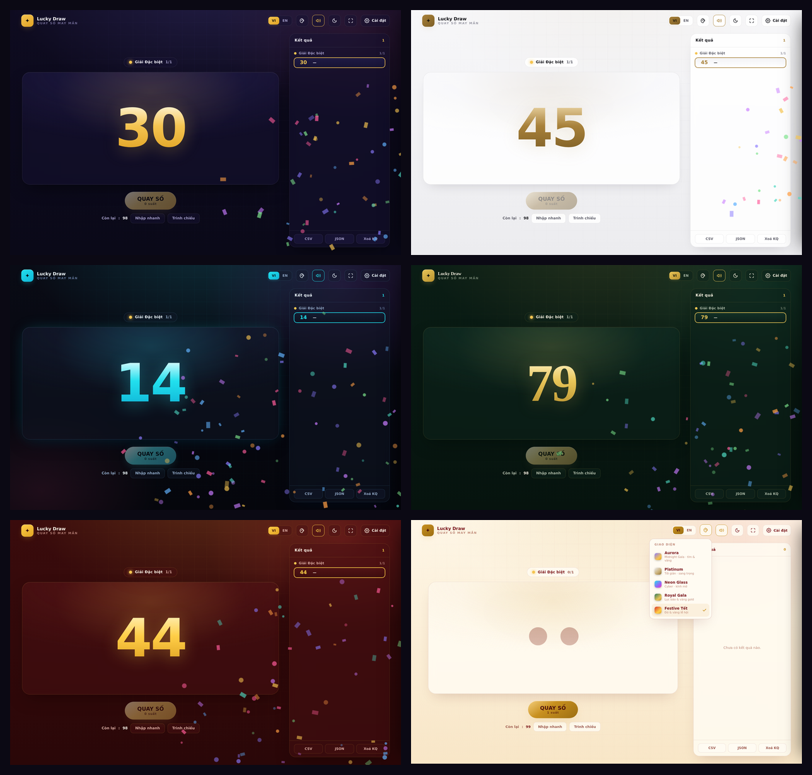
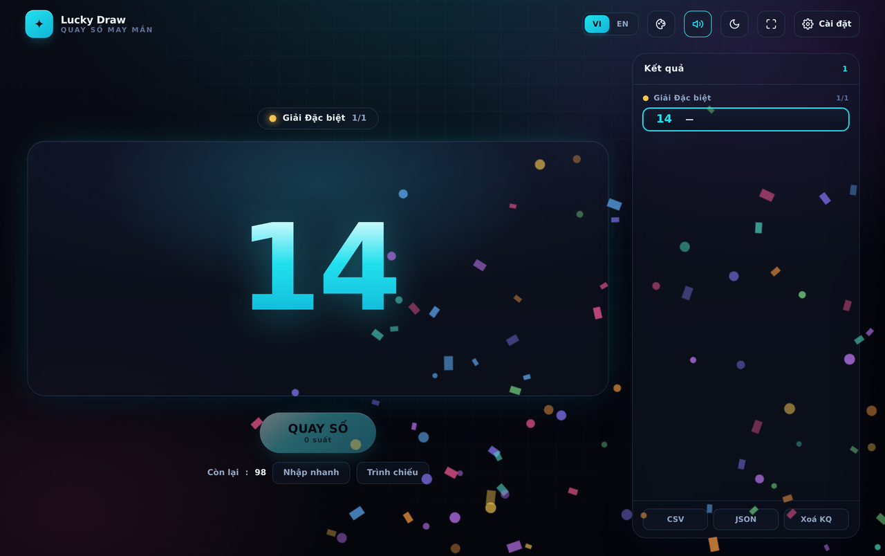
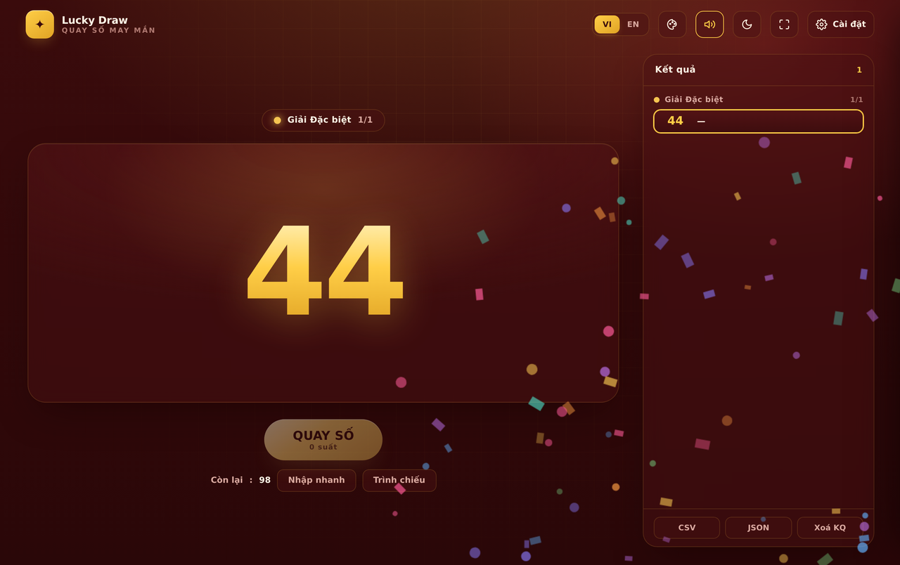
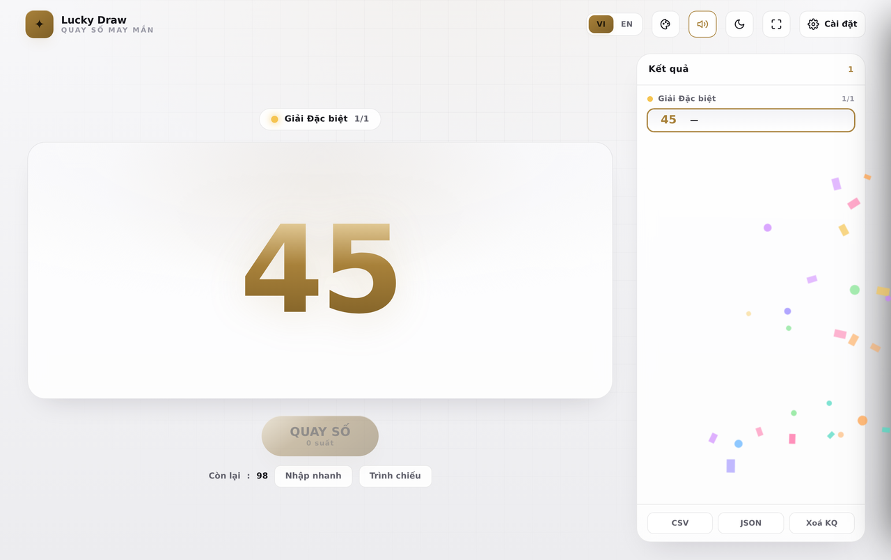
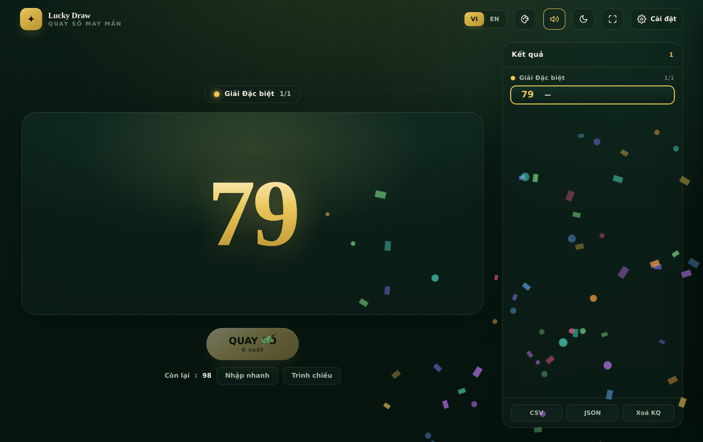
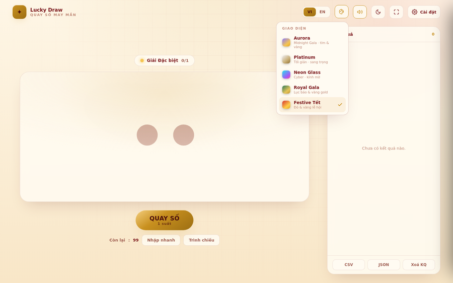

# 🎰 PaNIC-LuckyDraw — Quay số may mắn

**Ứng dụng quay số / bốc thăm trúng thưởng chạy hoàn toàn offline trong 1 file HTML.**
5 giao diện cao cấp đổi trực tiếp · Song ngữ VI/EN · Sáng/Tối · Hiệu ứng Slot / Số nhảy / Vòng quay.

### ▶️ [Xem demo trực tiếp](https://mdev-qn95.github.io/panic-lucky-draw/)

---

## ✨ Tính năng

- **1 file duy nhất, không cần cài đặt** — mở `index.html` là chạy, kể cả offline.
- **5 giao diện (skin) đổi trực tiếp** bằng nút 🎨 trên thanh công cụ, mỗi skin có riêng nền **Sáng/Tối**.
- **3 kiểu hiệu ứng quay:** Slot (ru-lô số), Số nhảy (scramble), Vòng quay (wheel).
- **Nguồn số linh hoạt:** nhập dải số (từ–đến, tự thêm số 0) hoặc dán/​import danh sách **CSV · Excel (.xlsx) · JSON · TSV**.
- **Cơ cấu giải nhiều bậc:** đặt tên giải, màu, số lượng người trúng, tuỳ chọn loại người đã trúng khỏi các lượt sau.
- **Quay nhiều người/lượt**, không trùng trong cùng lượt, chọn ngẫu nhiên **công bằng bằng `crypto.getRandomValues`** (hỗ trợ trọng số).
- **Bảng kết quả** trực tiếp + **xuất CSV / JSON**.
- **Chế độ trình chiếu** toàn màn hình, âm thanh & pháo hoa (confetti), tuỳ biến tên sự kiện & logo.
- **Lưu tự động** vào trình duyệt (localStorage) — đóng mở lại vẫn còn.
- **Song ngữ Tiếng Việt / English.**

## 🎨 Các giao diện

| Skin | Phong cách |
|------|-----------|
| **Aurora** | Midnight Gala — tím than & vàng gold (mặc định) |
| **Platinum** | Tối giản, sang trọng kiểu "quiet luxury", nền sáng |
| **Neon Glass** | Cyber, kính mờ, neon cyan/tím phát sáng |
| **Royal Gala** | Xanh lục bảo & vàng gold, chữ serif quý tộc |
| **Festive Tết** | Đỏ sơn mài & vàng lễ hội — hợp Tất niên |

 
 
 

## 🚀 Cách dùng

1. Tải hoặc clone repo, mở **`index.html`** bằng trình duyệt.
2. Bấm **Cài đặt** → tab **Nguồn số** để nhập dải số hoặc danh sách người tham gia.
3. Vào tab **Cơ cấu giải** để tạo các giải và số lượng người trúng.
4. Chọn giải ở thanh trên, bấm **QUAY SỐ** (hoặc phím `Space`).

**Phím tắt:** `Space` quay · `F` toàn màn hình · `Esc` thoát trình chiếu.

## 🌐 Deploy miễn phí bằng GitHub Pages

1. Đưa repo lên GitHub (để **Public**) với file `index.html` ở thư mục gốc.
2. Vào **Settings → Pages** → *Source*: **Deploy from a branch** → Branch **`main` / `/ (root)`** → **Save**.
3. Đợi ~1 phút, truy cập: `https://<username>.github.io/<repo>/`

> Trang web tĩnh nên chạy tốt trên mọi host tĩnh khác (Netlify, Vercel, Cloudflare Pages…).

## 🛠️ Công nghệ

HTML + CSS + Vanilla JavaScript thuần, **không framework, không dependency**. Đọc `.xlsx` bằng `DecompressionStream` gốc của trình duyệt. Font hiển thị từ Google Fonts (tự động về font hệ thống khi offline).

## 📄 Giấy phép

[MIT](LICENSE) © PaNIC
